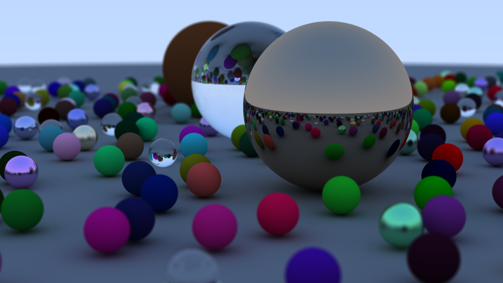

# RayTrace in Rust

这是一个摸鱼的项目，主要按照[Ray Tracing in One Weekend](https://raytracing.github.io/books/RayTracingInOneWeekend.html)的教程来完成的（不过这是个C++的项目，我拿Rust改写的）。

采用了`rayon`提供的多线程机制，性能相比原来还是好了不少。

这个项目中包含了以下要素：

- 奇怪的bug
- 不知所云的<<<>>>
- 低效的代码逻辑

# 效果

使用i7-13700F运行，渲染1920*1080分辨率图像，像素采样次数100，光线追踪深度50。随机场景效果如图：

单线程渲染消耗949.38秒，多线程渲染消耗81.8秒。

# 挖坑

- [ ] 贴图。
- [x] 三角形。
- [ ] 高级光照模拟。